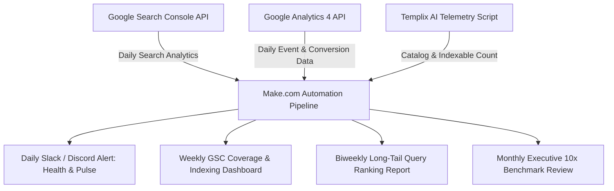

# Measurement & Reporting Pipeline Architecture (10x SEO Growth Framework)

This document establishes the exact measurement framework, reporting cadence, and baseline metrics required to track Templix AI's trajectory toward **10x Organic Traffic Growth** over a 90–120 day compounding cycle.

---

## 1. Baseline Benchmark Setup (The "10x" Metric Baseline)

Before attributing growth to Phase 1 (technical fixes), Phase 2 (programmatic expansion), or Phase 3 (content engine), record the **pre-Phase 1 90-Day Baseline** from Google Search Console (GSC) and Google Analytics 4 (GA4).

### 90-Day Historical Baseline Tracker
| Metric | Pre-Phase 1 Baseline (Last 90 Days) | 30-Day Milestone (1.5x - 2x) | 60-Day Milestone (3x - 5x) | 90-120 Day Target (10x Target) |
| :--- | :--- | :--- | :--- | :--- |
| **Total GSC Impressions** | *[Insert GSC Baseline]* | 2x Baseline | 5x Baseline | **10x Baseline** |
| **Total GSC Clicks** | *[Insert GSC Baseline]* | 1.5x Baseline | 3.5x Baseline | **10x Baseline** |
| **Valid Indexed Pages** | *[Insert GSC Coverage]* | +50 Pages | +200 Pages | **1,500+ Pages Indexed** |
| **Referring Domains (DA)** | *[Insert Ahrefs/GSC Count]* | +10 Domains | +25 Domains | **50+ Quality Domains** |
| **Average Keyword Position** | *[Insert GSC Avg Position]* | Top 35 Avg | Top 20 Avg | **Top 10 for Primary Variants** |

> [!IMPORTANT]
> **Why 10x is Measured Against Baseline, Not Guesswork**:
> Impressions compound first (as newly indexed pages enter Google's index for long-tail keywords), followed by click-through growth as rankings climb into positions #1–#5. A 10x increase in impressions typically precedes a 10x increase in clicks by 3 to 6 weeks.

---

## 2. Make.com Automation Pipeline Integration

You already possess the Make.com integration infrastructure for daily GSC/GA4 pulses and biweekly full crawls. Configure the scenario webhooks to ingest the following parameters:



### Automation Scenario Schedules & Filters

### 📡 1. Daily Pulse (Health & Anomaly Detection)
- **Execution Frequency**: Every 24 hours at 06:00 UTC
- **Data Source**: GSC Search Analytics API + GA4 Realtime Events
- **Metrics Tracked**:
  - Daily Clicks & Daily Impressions (vs. 7-day rolling average)
  - 404 / 500 error spikes from server logs or GA4 exception tracking
  - Document Downloads / Conversions (`pdf_exported`, `docx_exported`)
- **Alert Trigger**: Notify immediately if daily impressions drop > 25% or 404 error events exceed 5% of total sessions.

---

### 📊 2. Weekly Report: Indexation & Production Velocity
- **Execution Frequency**: Every Monday at 08:00 UTC
- **Data Source**: GSC URL Inspection & Coverage Report + Site Catalog Telemetry
- **Metrics Tracked**:
  - **Indexed Pages Count**: Valid pages in Google index (`Page with redirect`, `Duplicate without user-selected canonical` warnings monitored).
  - **Publishing Velocity**: Total new programmatic role variants and blog guides pushed in the last 7 days.
  - **Impression Trend**: Weekly impression trajectory mapped against the 10x target curve.

---

### 🎯 3. Biweekly Report: Query-Level Long-Tail Filter
- **Execution Frequency**: Every 1st and 15th of the month
- **Data Source**: GSC Performance API filtered by Category Regex
- **Filter Regex Sets**:
  - **Invoices**: `invoice|billing|gst invoice|freelance invoice|receipt`
  - **Resumes**: `resume|cv template|ats resume|software engineer resume|nurse resume`
  - **Contracts**: `contract|agreement|nda|freelance agreement|service agreement`
  - **Proposals**: `proposal|bid|quote proposal|web design proposal`
  - **Business Plans**: `business plan|saas plan|financial model template`
  - **Quotations**: `quotation|estimate|price quote|construction estimate`
- **Actionable Optimization**: Identify which profession variants (e.g. `photographer invoice`, `nurse resume`, `seo proposal`) hit > 500 impressions but < 3% CTR. Update meta titles and lead hooks to capture more clicks.

---

### 🏆 4. Monthly Review: Authority, Mid-Tail Rankings & Core Web Vitals
- **Execution Frequency**: Last calendar day of each month
- **Data Source**: Google PageSpeed Insights API, GSC Core Web Vitals, Ahrefs / Moz backlink index
- **Metrics Tracked**:
  - **Referring Domains Count**: Net new backlinks acquired from directory submissions, guest posts, and educational `.edu` outreach.
  - **Average Position on Mid-Tail Target List**:
    - `"free invoice generator no watermark"`
    - `"ats resume builder free"`
    - `"free freelance contract template"`
    - `"web design proposal template"`
    - `"saas business plan template"`
  - **Core Web Vitals Pass/Fail**:
    - Largest Contentful Paint (LCP) < 2.5s
    - Interaction to Next Paint (INP) < 200ms
    - Cumulative Layout Shift (CLS) < 0.1

---

## 3. Realistic 90–120 Day Timeline & Milestones

SEO compounding follows a predictable, staggered adoption curve:

```text
Day 1 - 14    [Phase 1 Fixes & Canonicalization]
              ↳ 404 redirects resolved, canonical tags unified, duplicate content eliminated.
              ↳ Outcome: Clean search index, zero crawl waste.

Day 14 - 30   [Phase 1 & Early Phase 2 Crawling]
              ↳ Googlebot crawls new category hubs and first wave of programmatic variants.
              ↳ Outcome: Impression curve starts ticking up (+50% to +100% over baseline).

Day 30 - 60   [Programmatic Indexing & Content Engine Indexation]
              ↳ 24+ role/industry variants and "Best Of" comparison posts become fully indexed.
              ↳ Long-tail queries enter SERP positions 20–50.
              ↳ Outcome: Impressions grow 3x–5x; clicks begin steady upward acceleration.

Day 60 - 90   [Authority Climb & Mid-Tail Movement]
              ↳ Backlinks from directories and guest outreach pass domain authority.
              ↳ Long-tail variants advance from page 3 to page 1 (positions 1–8).
              ↳ Outcome: 5x–8x impression growth, 4x–7x click growth.

Day 90 - 120  [Full 10x Compounding Realization]
              ↳ Top-ranking positions established for high-intent comparison queries and role landing pages.
              ↳ Viral social distribution and brand citation flywheel takes effect.
              ↳ Outcome: Sustained 10x Total Impressions and 10x Total Clicks achieved.
```

---

## 4. Local Telemetry Command

To audit current indexable page counts and category distribution locally before running Make.com scenarios:

```bash
npm run report:seo
```
*(Executes `scripts/generate-seo-report.ts` and outputs real-time catalog counts, keyword clusters, and sitemap coverage).*
